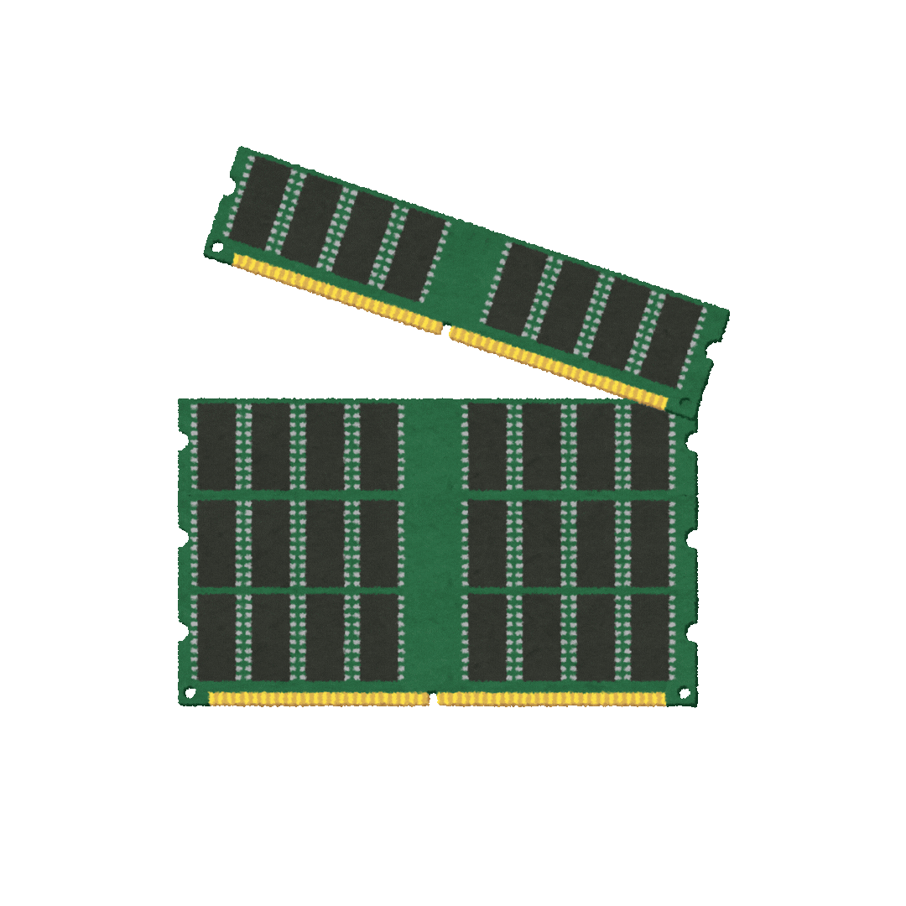

<!DOCTYPE html>
<html lang="en">
<head>
    <meta charset="UTF-8">
    <meta name="viewport" content="width=device-width, initial-scale=1.0">
    <link href="https://fonts.googleapis.com/css2?family=JetBrains+Mono&display=swap" rel="stylesheet">
    
</head>
<body>

<section id="contributions">
<header>

Recent contributions

</header>

<a href="https://github.com/as-mi/site-cariere-nou">
Cariere v14 Web Application

Full-Stack Development @ ASMI

</a>

<a href="https://gitlab.com/users/nitronlp/project">
NitroNLP Competition Platform

Front-End Development @ NitroNLP

</a>

<a href="https://github.com/vlaxcs/FMI-INFO-S15-2024-2027">
Olympics' Class Materials

Fueling academic excellence @ FMI.UNIBUC.RO

</a>

</section>

</body>
</html>
